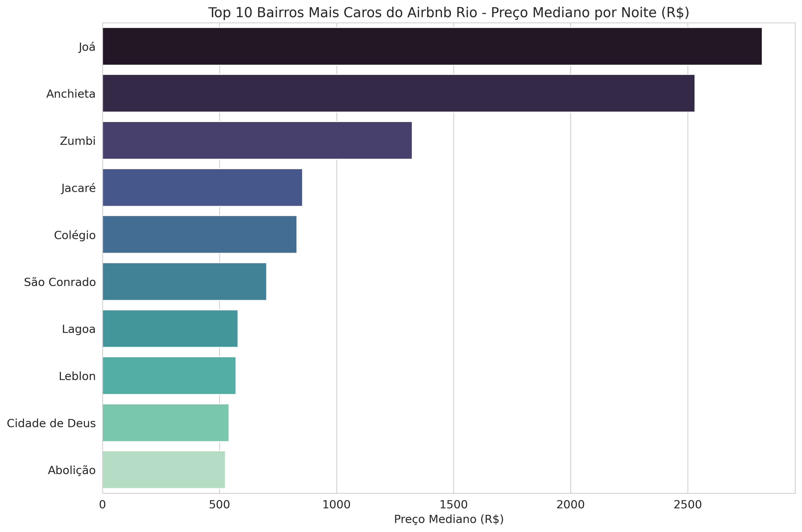

# 📊 Análise de Dados do Airbnb no Rio de Janeiro  
**Explorando padrões de preços, características dos imóveis e insights de negócio no mercado de aluguel por temporada**

---

## 🎯 Objetivo do Projeto

Este projeto analisa dados do Airbnb no Rio de Janeiro com o objetivo de:

- Identificar os bairros com as maiores médias de preços.  
- Entender como características dos anúncios influenciam valor e ocupação.  
- Gerar visualizações claras e diretas produzidas em Python no Linux.  
- Demonstrar minha capacidade prática como Analista de Dados: tratamento, análise, visualização e interpretação.

---

## 🛠️ Tecnologias Utilizadas

- **Python** (Pandas, Matplotlib, Seaborn)  
- **PostgreSQL**  
- **Linux (Ubuntu)**  
- **Git e GitHub**

---

## 📂 Estrutura do Repositório

projetos_airbnb/
│
├── sql/ # Arquivos .sql utilizados para consultas e manipulação dos dados
├── imagens/ # Gráficos gerados durante a análise (Python)
├── dados/ # Dataset utilizado (se for permitido disponibilizar)
└── README.md # Documentação do projeto

## 📊 Visualizações

As visualizações foram geradas diretamente em Python no Linux.

### 🏆 Top 10 Bairros com Diárias Mais Caras

**Insight:**  
Bairros turísticos — como **Leblon, Ipanema e Copacabana** — concentram os maiores preços médios por diária.  
Isso confirma o comportamento esperado do mercado: regiões com alta demanda tendem a manter preços elevados e estáveis.

---

## 🔍 Principais Descobertas da Análise

- **Leblon** lidera como o bairro mais caro por diária.  
- Existem diferenças claras entre bairros turísticos e bairros residenciais.  
- A distribuição dos preços é assimétrica: poucos anúncios muito caros elevam a média geral.  
- A maior parte dos anúncios possui faixa de preço intermediária, formando uma concentração central.  

Essas observações são importantes para entender comportamento de oferta, demanda e precificação na plataforma.

---

## 🧹 Etapas do Processamento de Dados

- Importação do dataset.  
- Limpeza e padronização das colunas.  
- Remoção de valores inconsistentes.  
- Agrupamento e cálculo de métricas relevantes.  
- Criação dos gráficos a partir dos dados tratados.

Tudo desenvolvido diretamente no Linux com Python.

---

## 🚀 Como Reproduzir o Projeto

1. Clone este repositório:

   git clone https://github.com/vvania-ssantos/projetos_airbnb.git

Acesse o diretório:
cd projetos_airbnb

Instale as dependências (se houver um requirements.txt no futuro):
pip install -r requirements.txt
Execute os arquivos Python ou SQL conforme necessário.

👩‍💻 Sobre Mim
Sou Vania dos Santos, Analista de Dados em formação e apaixonada por resolver problemas através de dados.
Este projeto faz parte da minha evolução prática, fortalecendo minha capacidade de transformar dados em informação útil, clara e aplicável.

🔗 LinkedIn: https://linkedin.com/in/vaniadossantos

🧠 GitHub: https://github.com/vvania-ssantos

